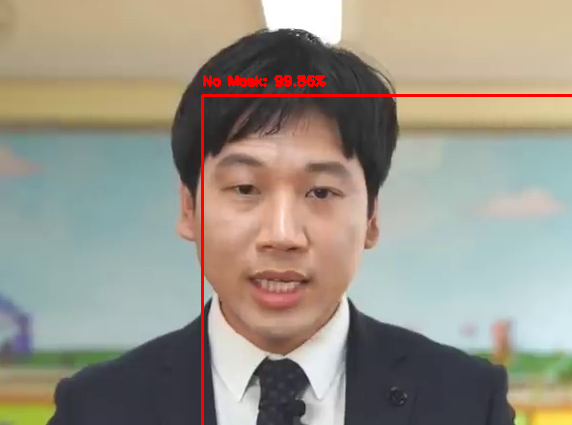
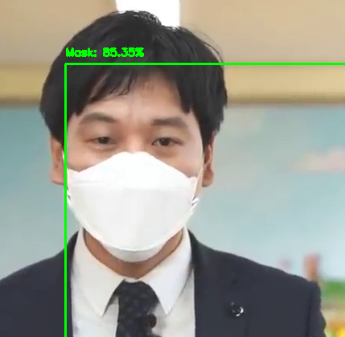
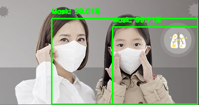

# FaceRecognition
실시간 마스크 착용 여부 감지 모델
- Mobilenet V2 CNN 모델을 사용하여 마스크 착용 여부를 Predict함. 
- Face Detection은 Caffe2 프레임워크 사용

## Description




## Import Module
 OpenCV with python3

- keras, plaidml-keras(AMD GPU Computing), 
- numpy
- matplotlib
- argparse
- tensorflow 2.2.0

## Usage
##### Train
```$ python train_mask_detector.py --dataset dataset```

##### Image
```$ python detection.py --image [Path to Image]```
##### video
- detection.py 내의 video path 변경 후 사용
```$ python detection_video.py```


